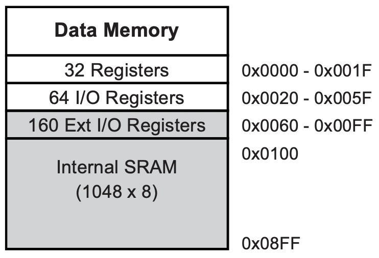
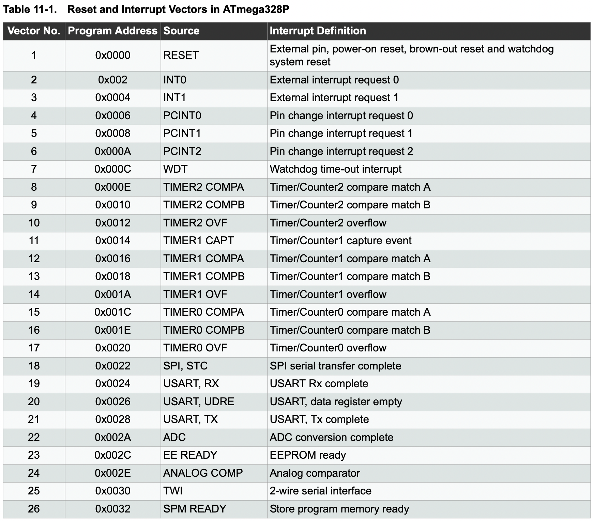

# Notes
## Data space
The ATmega328p is the microprocessor contained in all arduino unos, and is part of the `avr` family of microcontrollers. The ATmega328p contains 32 8 bit registers, and the register file is actually mapped directly into the first 32 bytes of data memory space. Following the registers 64 bytes of space for IO registers, then 160 bytes of extended IO space for more IO registers. The rest of the space from address `0x100` to `0x8FF` is mapped to internal SRAM.



The `in` and `out` instructions can access the first 64 IO registers. Accessing IO registers in extended IO space is performed using load store instructions (`ld`, `lds`, `ldd`, `st`, `sts`, `std`). The first 64 bit registers can also be accessed using load store instructions, but `0x20` must be added to their address first to skip over the register file.

## eeprom
While SRAM is great for storing data used during program execution, the data is lost as soon as the microprocessor loses power. The ATmega328p also contains 1024 (1 kilobyte) of eeprom, which is non volatile memory. This means that it retains its data after power is lost. The eeprom memory space is separate from data space and cannot be accessed directly using `in`, `out`, or load store instructions. Instead it must be accessed using eeprom registers located in IO space to perform read and write operations. The eeprom should be able to store data without power for around 20 years, and has a write cycle of around 100k. This means that after 100k write operations the eeprom's data retention time will begin to decrease, but does not mean that the eeprom data will immeadiately begin to corrupt its data.

## stack
Unlike `x86-64` or `arm`, the `avr`'s stack is post decremented, not pre decremented. In `x86-64` a push operation decrements the stack, then writes a value to the stack pointer. In `avr` a value is written to the stack, and afterwards the stack is decremented. This makes it so that in `avr` the entire stack is offset by one byte.
Note: the stack pointers default value is set to point to the top of SRAM, so it is possible for the stack to collide with data stored in low SRAM.

```x86asm
in ZH, SPH
in ZL, SPL
ldi r17, 0x00
ldi r16, 0xFF
st  Z,   r16
std Z+1, r17
pop r18
; r18 = 0x00
```

Typically one would expect that if you write a value to the current stack pointer, then pop a value off the stack the popped value would be the byte at the top of the stack. But in `avr` that is not the case. To complement the push instructions post decrement scheme, the pop instruction increments the stack pointer before reading a value from the stack. This means that a pop operation actually read `*(sp + 1)`, not `*sp`.

## program counter
While the 16 bit stack pointer is mapped as an IO register and is fully readable and writable, the program counter (pc) is not directly accessable. The only way to write an arbitrary value into the pc is to write a that value to the stack and proceeding to execute a ret or reti instruction. Note that the high 8 bits of the return address must be pushed to the stack before the low 8 bits.

```x86asm
ldi r17, 0xDE
ldi r16, 0xAD
push r17
push r16
ret
; pc = 0xDEAD
```

This may be useful when constructing a jump table for a match statement.

## 16 bit timer registers
16 bit timer registers (timer 1 & 2), have special rules for accessing 16 bit registers. Read and write operations are assisted by a 8 bit temporary register internal to the timer. To read a 16 bit register the low byte must be read before the high byte, and to write to a 16 bit register the high byte must be written before the low byte. This is described in greater detail in section 15.3 Accessing 16-bit Registers of the ATmega328p datasheet.

## interrupts

<sup>You might notice that the difference between interrupt entry address is 2, not 4. I know that the entries must be 4 bytes wide because in an example interrupt table in the datasheet the reset vector contains a jmp instruction which is 4 bytes wide. For some strange reason the base unit of program memory space is 2 bytes, not 1 byte. This might have something to do with the avra assembler which also exhibits this behavior.</sup>

The first 104 bytes of program space are dedicated to the interrupt table, and contains 26 entries (each entry is 4 bytes wide, probably so that there is enough space to fit a direct branch instruction). The entries do not store the address of an interrupt handler but instead are meant to contain a branch to the corresponding handler.

When an interrupt occurs it pushes the current program counter to the stack, and clears the interrupt flag so that nested interrupts cannot occur unless explicitly enabled by setting the interrupt flag within the handler. Interrupts do not automatically save the contents of registers or the status register. If they are modified within the handler they first must be saved and restored before exiting the handler. The `reti` instruction performs the exact same operation as the `ret` instruction except `reti` sets the interrupt flag before returning. Execution starts at address `0x0000` which is the reset vector, and meant to contain a jump to the main program. But if the main program itself is located at address `0x0000` and the program does not intend to use interrupts at all the table can be ommited entirely.

## avr assembler (avra) vs. avr-gcc
avr-gcc is fully capable of assembling assembly code, but avra uses different syntax and directives from avr-gcc. Therefore assembly written for avra should not be compatible at all with avr-gcc. Internally the [Arduino IDE](https://www.arduino.cc/en/software) uses avr-gcc to compile its code, so writing assembly code in the Arduino IDE must follow proper syntax recognized by avr-gcc.

## Debugging
Through my research I have found a few methods to debug arduino code.
1. emulation using [qemu-system-avr](https://www.qemu.org) and [avr-gdb](https://www.microchip.com/en-us/tools-resources/develop/microchip-studio/gcc-compilers)
    - Downloading qemu should give access to qemu-system-avr, and avr-gdb in shipped with the avr toolchain. Although avr-gdb is compiled for x86-64 it works fine on M1 macs.
2. [platform IO IDE](https://platformio.org) debugger
    - Platform IO can be downloaded as a vscode extension, although debugging requires gdb to be installed on the system.
3. [Tinkercad](https://www.tinkercad.com) circuit simulator and debugger
    - Is able to simulate an virtual arduino uno. However does not support assembler source files, only C/C++.
4. [Simulavr](https://www.nongnu.org/simulavr/)
5. [Avarice](http://avarice.sourceforge.net)

## Resources
 - [avr instruction set](https://ww1.microchip.com/downloads/en/DeviceDoc/AVR-Instruction-Set-Manual-DS40002198A.pdf)
 - [avra assembler documentation](https://ww1.microchip.com/downloads/en/DeviceDoc/40001917A.pdf)
 - [ATmega328p microprocessor datasheet](https://ww1.microchip.com/downloads/en/DeviceDoc/Atmel-7810-Automotive-Microcontrollers-ATmega328P_Datasheet.pdf)
 - [avr-gcc documentation](https://gcc.gnu.org/wiki/avr-gcc)