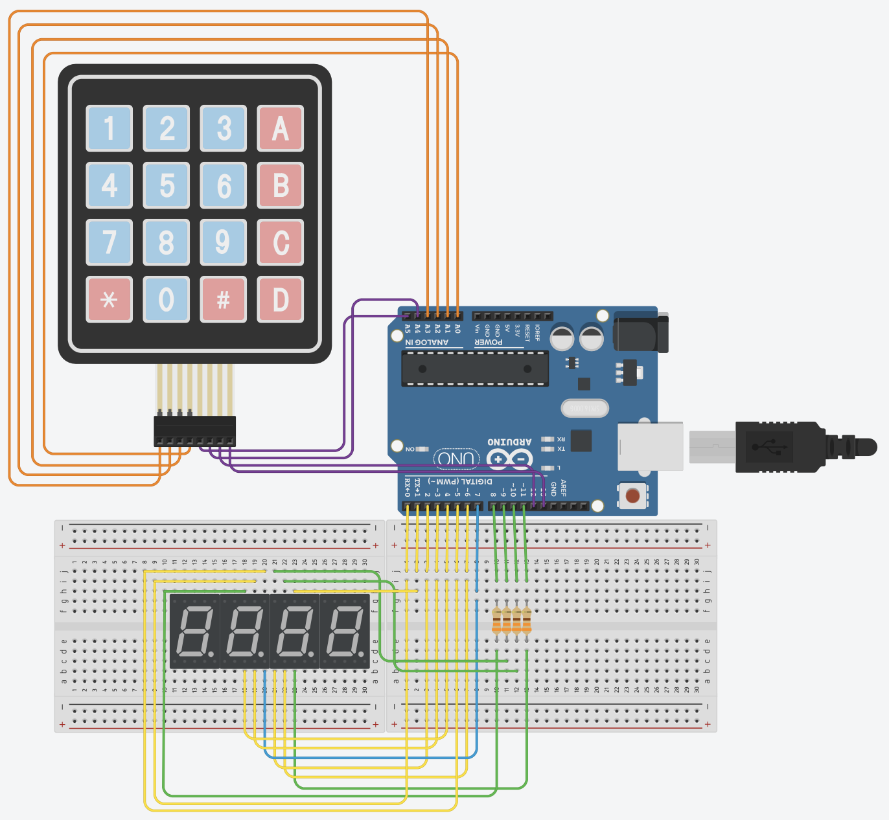

# Arduino Clock

A working digital clock using a 4 digit 7 segment display. The clock stores time as hours:minutes and by default starts at `00:00`. The clock time can be manually set by pressing `*` on the keypad and proceeding to enter the new time.

## TODO
 - make sure time inputted by keypad is a valid time
 - potentially change how the digit are stored. The digits are stored in pairs of 2 as packed bcd integers, which allows for easier range checking (e.g. resetting digits to 0 after reaching 60 or 24). Although it forces the any code that processes the digits to operate on 2 digits at a time which leads to some code duplication.
 - current wire configuration uses all of the arduino pins, perhaps rewire keypad to share pins 0-7 with the 4 digit 7 segment display

## Bugs
 - keypad code sometimes registers key presses when releasing a key
 - keypad code sometimes mistakenly detects a key press in the top most row
 - keypad operates strangely after switching power sources (only occurred once)

## Quirks
 - input time is entered from right to left